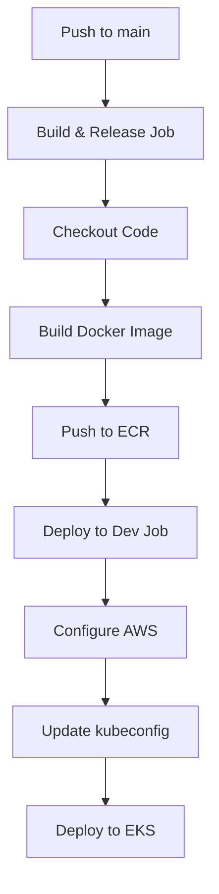

# Hello World EKS Python Flask Application

A simple Python Flask web application that returns a "Hello World" message, designed for deployment on Amazon EKS (Elastic Kubernetes Service).

## 🚀 Features

- **Simple Flask API**: Lightweight web application serving a Hello World message
- **Health Check Endpoints**: Built-in health monitoring for Kubernetes probes
- **Production Ready**: Configured with Gunicorn WSGI server for production deployment
- **Containerized**: Docker-ready with optimized multi-stage build
- **Kubernetes Native**: Complete EKS deployment manifests included
- **Auto-scaling**: Horizontal Pod Autoscaler configuration
- **Load Balancer**: AWS Network Load Balancer integration

## 📋 Prerequisites

- Python 3.11+
- Docker
- Kubernetes cluster (EKS)
- kubectl configured for your cluster

## 🛠️ Local Development

### Running with Python

1. **Clone the repository**
   ```bash
   git clone https://github.com/jguilhermesoares/hello-world-eks-python.git
   cd hello-world-eks-python
   ```

2. **Install dependencies**
   ```bash
   pip install -r requirements.txt
   ```

3. **Run the application**
   ```bash
   python app.py
   ```

4. **Test the application**
   ```bash
   curl http://localhost:8000
   # Expected output: Hello World from Python Flask!
   
   curl http://localhost:8000/health
   # Expected output: {"status": "healthy", "message": "Application is running"}
   ```

### Running with Docker

1. **Build the Docker image**
   ```bash
   docker build -t hello-world-flask .
   ```

2. **Run the container**
   ```bash
   docker run -p 8000:8000 hello-world-flask
   ```

3. **Test the containerized application**
   ```bash
   curl http://localhost:8000
   ```

## 🌐 API Endpoints

| Endpoint | Method | Description | Response |
|----------|--------|-------------|----------|
| `/` | GET | Main application endpoint | `Hello World from Python Flask!` |
| `/health` | GET | Health check for load balancers | `{"status": "healthy", "message": "Application is running"}` |
| `/oms/marketplace/mgmt/health/liveness` | GET | Kubernetes liveness probe | `{"status": "alive", "message": "Application is alive"}` |

## 🚢 Deployment

### Kubernetes/EKS Deployment

The application uses environment variable substitution in the Kubernetes manifests. Set the following variables before deployment:

```bash
export APP="hello-world-flask"
export APP_DEPLOY_ENV="production"
export GITHUB_SHA="latest"
export ECR_REGISTRY="your-ecr-registry"
export SERVER_PORT="8000"
export POD_COUNT="2"
export DOMAIN=".yourdomain.com"

# Resource limits and requests
export K8S_RESOURCES_LIMITS_CPU="100m"
export K8S_RESOURCES_LIMITS_MEMORY="100Mi"
export K8S_RESOURCES_REQUESTS_CPU="100m"
export K8S_RESOURCES_REQUESTS_MEMORY="10Mi"

# HPA configuration
export K8S_HPA_MIN_REPLICAS="2"
export K8S_HPA_MAX_REPLICAS="3"
export K8S_HPA_CPU_UTILIZATION="70"
```

Deploy to Kubernetes:
```bash
envsubst < manifest.yaml | kubectl apply -f -
```

### CI/CD Pipeline (GitHub Actions)

This repository includes a complete CI/CD pipeline using GitHub Actions that automatically builds, pushes, and deploys the application.

#### Pipeline Overview

The CI/CD pipeline consists of two main workflows:

##### 1. **Build & Release** (`.github/workflows/release.yaml`)
Triggered on every push to `main` branch or manual workflow dispatch:

```yaml
# Workflow triggers
on:
  push:
    branches: [ main ]
  workflow_dispatch:
```

**Jobs:**
- **Build & Release**: Builds Docker image and pushes to Amazon ECR
- **Deploy to Dev**: Automatically deploys to development environment

##### 2. **Docker Build Action** (`.github/actions/action.yaml`)
Reusable composite action for building and pushing Docker images:

**Features:**
- Sets up Docker Buildx for advanced build features
- Configures AWS credentials securely
- Logs into Amazon ECR registry
- Builds and tags images with Git SHA
- Pushes images to ECR
- Automatically logs out for security

#### Required Secrets

Configure the following secrets in your GitHub repository:

| Secret Name | Description | Environment |
|-------------|-------------|-------------|
| `SHARED_ACCOUNT_AWS_ACCESS_KEY_ID` | AWS Access Key for ECR push | Global |
| `SHARED_ACCOUNT_AWS_SECRET_ACCESS_KEY` | AWS Secret Key for ECR push | Global |
| `DEV_AWS_ACCESS_KEY_ID` | AWS Access Key for dev deployment | Dev environment |
| `DEV_AWS_SECRET_ACCESS_KEY` | AWS Secret Key for dev deployment | Dev environment |

#### Environment Configuration

**Development Environment Variables:**
```yaml
APP: ${{ github.repository }}          # Application name (repository name)
REGION: us-east-1                       # AWS region
CLUSTER_NAME: dev-eks-cluster           # EKS cluster name
K8S_RESOURCES_REQUESTS_MEMORY: 100Mi    # Memory requests
K8S_RESOURCES_REQUESTS_CPU: 100m        # CPU requests  
K8S_RESOURCES_LIMITS_MEMORY: 100Mi      # Memory limits
K8S_RESOURCES_LIMITS_CPU: 100m          # CPU limits
K8S_HPA_MIN_REPLICAS: 2                 # Minimum replicas
K8S_HPA_MAX_REPLICAS: 3                 # Maximum replicas
K8S_HPA_CPU_UTILIZATION: 80             # CPU utilization threshold
APP_DEPLOY_ENV: "dev"                   # Deployment environment
```

#### Pipeline Flow



#### Manual Deployment

You can also trigger deployments manually:

1. **Via GitHub UI**: Go to Actions tab → "Build & Deployment" → "Run workflow"

2. **Via GitHub CLI**:
   ```bash
   gh workflow run release.yaml
   ```

#### Deployment Configuration

⚠️ **Note**: The GitHub Actions workflow currently references `eks/deployment.yml`, but the actual deployment manifest is `manifest.yaml` in the root directory. Update the workflow file to use the correct path:

```yaml
# In .github/workflows/release.yaml, change:
envsubst < eks/deployment.yml | kubectl apply -f -
# To:
envsubst < manifest.yaml | kubectl apply -f -
```

#### Adding New Environments

To add additional environments (staging, production):

1. Create new environment in GitHub repository settings
2. Add environment-specific secrets  
3. Add new job in `.github/workflows/release.yaml`:

```yaml
staging:
  needs: dev
  name: Deploy to Staging
  environment:
    name: staging
  env:
    APP_DEPLOY_ENV: "staging"
    CLUSTER_NAME: staging-eks-cluster
    # ... other environment-specific variables
  # ... rest of deployment steps
```

#### Pipeline Benefits

- **Automated Builds**: Every push to main automatically builds and deploys
- **Security**: Uses IAM roles and encrypted secrets
- **Rollback Ready**: Git SHA tagging enables easy rollbacks
- **Environment Isolation**: Separate AWS accounts/credentials per environment
- **Scalable**: Easy to add new environments and deployment targets

## 🏗️ Architecture

```
┌─────────────────┐    ┌─────────────────┐    ┌─────────────────┐
│   Load Balancer │ -> │   Kubernetes    │ -> │   Flask App     │
│   (AWS NLB)     │    │   Service       │    │   (Gunicorn)    │
└─────────────────┘    └─────────────────┘    └─────────────────┘
```

### Components

- **Flask Application**: Lightweight Python web framework serving the API
- **Gunicorn**: Production WSGI server with 4 worker processes
- **Docker Container**: Secure containerized deployment with non-root user
- **Kubernetes Service**: ClusterIP service exposing the application
- **Network Load Balancer**: AWS NLB for external traffic routing
- **Horizontal Pod Autoscaler**: Automatic scaling based on CPU utilization

## 🔧 Configuration

### Environment Variables

| Variable | Description | Default |
|----------|-------------|---------|
| `FLASK_ENV` | Flask environment mode | `production` |
| `PYTHONUNBUFFERED` | Ensure Python output is not buffered | `1` |

### Health Checks

- **Liveness Probe**: `/health` endpoint checked every 60 seconds
- **Readiness Probe**: `/health` endpoint checked every 10 seconds
- **Initial Delay**: 15 seconds for liveness, 5 seconds for readiness

## 📊 Monitoring

The application includes built-in health check endpoints that can be used with:
- Kubernetes probes (liveness and readiness)
- Load balancer health checks
- External monitoring tools

## 🔒 Security

- Runs as non-root user in container
- Minimal Python slim base image
- No unnecessary packages installed
- Security best practices for Kubernetes deployment

## 🤝 Contributing

1. Fork the repository
2. Create a feature branch (`git checkout -b feature/amazing-feature`)
3. Commit your changes (`git commit -m 'Add some amazing feature'`)
4. Push to the branch (`git push origin feature/amazing-feature`)
5. Open a Pull Request

## 📝 License

This project is licensed under the MIT License - see the [LICENSE](LICENSE) file for details.

## 🐛 Troubleshooting

### Common Issues

1. **Port conflicts**: Ensure ports 8000/8081 are not in use
2. **Docker build fails**: Check that all files are present and requirements.txt is valid
3. **Kubernetes deployment fails**: Verify all environment variables are set correctly
4. **Health checks failing**: Ensure the application is listening on the correct port

### Logs

```bash
# View application logs in Kubernetes
kubectl logs -f deployment/hello-world-flask-production -n hello-world-flask-production

# View local Docker logs
docker logs <container-id>
```

## 📞 Support

For questions or issues, please open an issue in this repository.
Python Hello World App running on EKS
